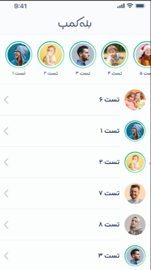

# Browser

در این بخش با مرورگرها و اینکه چگونه کار میکنند بیشتر آشنا میشوید. مرورگرها api های مختلفی دارند که از آنها میتوان برای توانمندکردن وب اپلیکیشن‌ها استفاده کرد.

## How Browser works?

- https://developer.mozilla.org/en-US/docs/Web/Performance/How_browsers_work

## APIs

- Storage
- Events
- Location / History
- Media
- Canvas

## منابع

- [Storage](https://javascript.info/data-storage)
- [Events](https://javascript.info/events)
- [UI Events](https://javascript.info/event-details)
- [History](https://developer.mozilla.org/en-US/docs/Web/API/History_API)
- [Canvas](https://developer.mozilla.org/en-US/docs/Web/API/Canvas_API)

## تمرین‌ها

یک روتر جاوااسکریپتی مطابق این [طرح](https://www.figma.com/design/gh72rTRBhltIE6KRXdK9VH/BALE-CAMP-router?node-id=0-1&t=PQVILtyfhEkT3vOI-1) پیاده سازی کنید. روت های این پروژه شامل روتهای زیر است:

- /
- /profile/:id
- /story/:id

- با کلیک بر روی آواتارهایی که استوری دارند باید استوری آنها نمایش داده شود. (چه در اواتار داخل پروفایل کلیک شود چه در آواتار صفحه اصلی)
- با کلیک بر روی نام کاربر داخل استوری کلیک شود باید وارد پروفایل شخص شود.
- هر لحظه با بک زدن باید بتوانیم به روت قبلی بازگردیم.
- با رفرش کردن روی هر روت باید دقیقا همان کامپوننت متناسب با روت آن نمایش داده شود.

نکات پیاده سازی:

- تمپلیت پروژه در گیتلب در این [لینک](https://gitlab.com/bale.ai/internship/bootcamp/-/tree/main/front/exercises/js-router) در دسترس است.
- این پروژه باید با استفاده از تایپ اسکریپت و scss پیاده سازی شود و نباید فریم ورک یا پکیجی استفاده شود.
- روت‌های متناظر با هر یک از روت‌هایی که در بالا مطرح شد را با استفاده از Regex تشخیص دهید.
- دیتای مورد نیاز برای نمایش به صورت فایل json در پوشه data است.