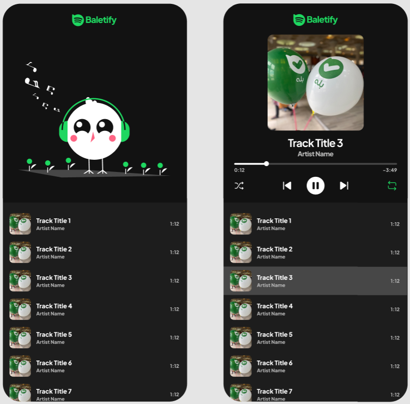

در این پروژه باید یک موزیک پلیر baletify پیاده‌سازی کنید. طرح این پروژه در این [لینک](https://www.figma.com/design/oMWW10qhpRxgLdDchEXk3I/Baletify?node-id=0%3A1&t=1guqwUVB8t7Ohnu2-1) در دسترس است.

- با زدن برروی گزینه shuffle اهنگ ها به صورت پلی لیست با ترتیب تصادفی چیده میشوند. در صورتی که در این حالت بک بزنیم آهنگ بعدی باید ترتیب تصادفی دیگری داشته باشد.

پیاده‌سازی:

- تمپلیت پروژه در گیتلب در این [لینک](https://gitlab.com/bale.ai/internship/bootcamp/-/tree/main/front/baletify) در دسترس است.
- این پروژه باید با معماری MVC پیاده‌سازی شود.
- این پروژه باید با استفاده از تایپ اسکریپت و scss پیاده‌سازی شود.
- برای پیاده‌سازی پروژه مجاز به استفاده از پکیج دیگری نیستید.
- داده‌ی آلبوم‌ها و آهنگ‌ها به صورت فایل json در اختیار شما قرار می‌گیرد.
- موسیقی‌ها پس از دانلود باید در دیتابیس ذخیره شده و در دفعات بعدی به جای دانلود از لینک از دیتابیس خوانده شود.
- پنج رفتار را انتخاب کرده و تست‌های مناسب آن را بنویسید.
- دیتای مورد نیاز برای نمایش به صورت فایل json در پوشه data است.
