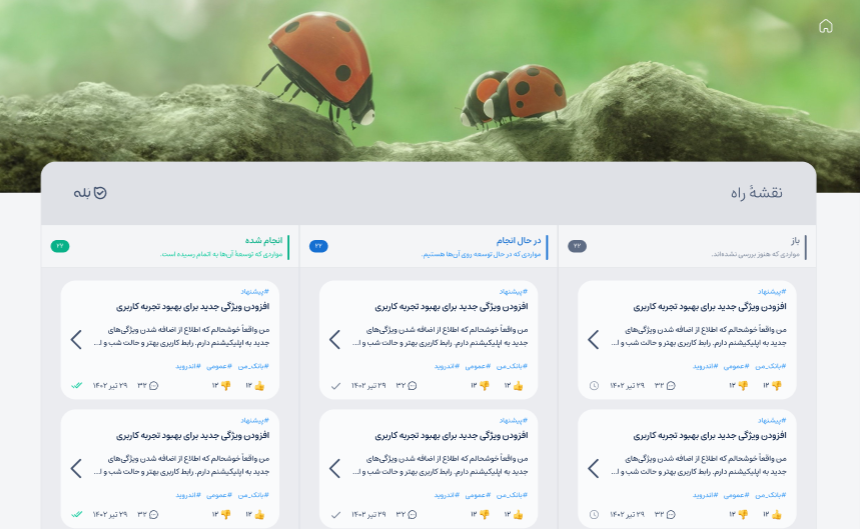

در این پروژه می‌خواهیم یک سیستم دریافت بازخورد از کاربران بله پیاده‌سازی کنید. طرح این پروژه در این [لینک](https://www.figma.com/design/1AJ6rckyHxxA255HcPppEu/Kafshdoozak?node-id=0-1&m=dev) در دسترس است.

### لیست کارها و ویژگی‌ها
- ایجاد ساختار Routing شامل Routeهای زیر

  - /signup
  - /login
  - /board
  - /issues
  - /issues/:issueId
  - /issues/new
  - /issues/:issueId/edit

  به صورت پیشفرش کاربر باید صفحه‌ی /issues را مشاهده کند

  در صورتی که کاربر قصد انجام کاری (اضافه کردن باگ یا پیشنهاد یا نظر گذاشتن و...) باید به صفحه‌ی ورود هدایت شود.

  در صورتی که کاربر وارد شده بود اگر به Route /login یا /signup رفت باید به صفحه‌ی قبلی که بوده باید به صفحه‌ی اصلی هدایت شود.

- پیاده سازی صفحه‌ی اصلی 

  - مشاهده موضوعات با فیلترهای پیشفرض
  - بارگزاری موضوعات هنگام اسکرول به پایین صفحه
  - رای دادن به موضوعات
  - مرتب سازی براساس تاریخ، تعداد رای، تعداد نظر
  - فیلتر براساس وضعیت، نوع، برچسب‌های موضوعات

- پیاده سازی صفحه‌ی یک موضوع
  - نمایش کامل موضوع به همراه جزئیات
    - پیشنمایش تصاویر و ویدیوها
    - بزرگنمایی تصاویر و ویدیوها
    - امکان دانلود
  - نمایش نظرات
  - بارگزاری نظرات هنگام اسکرول

- ارسال یک موضوع
  - ارسال مجدد در صورت بروز خطا
- ارسال نظر
  - ارسال مجدد در صورت بروز خطا

- پیاده‌سازی صفحه‌ی board

- ارسال فایل برای موضوع و نظر جدید
  - انتخاب و ارسال چند فایل (ترتیبی)
  - نمایش درصد در حال آپلود
  - ارسال مجدد در صورت بروز خطا

- صفحه‌ی پروفایل
  - ویرایش نام
  - تغییر رمز عبور

### ویژگی های مورد نیاز برای مدیر

- crud برچسب ها
- بررسی و انتشار موضوعات دریافت شده
- حذف موضوعات
- تغییر وضعیت یک موضوع 
  - در صفحه ی موضوع
  - به صورت DnD در صفحه‌ی board
- صفحه‌ی تعیین دسترسی کاربر
  باید با جستجو یک کاربر را پیدا کند و دسترسی اون را تغییر دهد.
  
### نکات پیاده‌سازی:
- تمپلیت شروع پروژه در گیتلب در این [لینک](https://gitlab.com/bale.ai/internship/bootcamp/-/tree/main/front/final-project) در دسترس است.
- پروژه باید با استفاده از react ، react-router ، redux-toolkit و rxjs پیاده‌سازی شود.
- این پروژه باید با استفاده از تایپ اسکریپت و scss پیاده‌سازی شود.
- برای پیاده‌سازی مجاز به استفاده از پکیج‌‌های دیگری مانند axios، drag&drop و… نیستید. 
- برای پیاده‌سازی تم لایت و دارک پروژه باید از css variables استفاده شود ولی برای تغییر رنگ آیکن‌ها در تم دارک و لایت از context ریکت استفاده شود.
- ریکوئست‌های جستجو باید با تاخیر زده شوند. یعنی در صورتی که از آخرین تایپ ۱ ثانیه گذشته باشد ریکوئست زده شود. برای اینکار یک هوک پیاده سازی کنید که اجرای توابع یا آپدیت استیت را تا زمانی که یک دوره زمانی مشخص بدون تغییر بیشتر در مقدار ورودی سپری شده باشد به تأخیر می‌اندازد.
- آپلود فایل‌ها در قسمت ارسال بازخورد جدید باید به صورت sequential باشد و هر زمان فقط یک فایل در حال آپلود در سرور باشد.
- قسمت نمایش issue ها باید به صورت infinite scroll پیاده‌سازی شود که برای آن از هوکی در تمرین ۴ بخش ریکت پیاده‌سازی کردید استفاده کنید.
- مودال‌های پروژه باید با استفاده از [portal](https://react.dev/reference/react-dom/createPortal) پیاده‌سازی شود.
- کامپوننت‌ها باید با توجه به route فعلی lazyload باشند. یعنی هر کامپوننت را تنها زمانی که به route آن میرویم لود کنیم.
