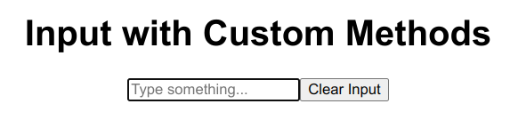

# React

یادگیری React به شما امکان می‌دهد تا برنامه‌های تحت وب پویا و کارآمدی ایجاد کنید. با یادگیری این کتابخانه جاوااسکریپت می‌توانید رابط‌های کاربری مدرن بسازید. در این بخش با اصول مهم و امکانات ریکت بیشتر آشنا میشوید.

- State Structure
- State vs Ref
- Context
  - useContext
- Forwarding Ref
  - useImperativeHandle
- Hooks
  - Rules
  - useCallback
  - useMemo
  - useEffect
  - useLayoutEffect
  - useReducer
- Virtual DOM
  - Virtual list
- Lazy Loading
  - Suspense
- Portal
- Memo
- Routing (react-router)

## منابع
- [React Official Documentation](https://react.dev/learn)
- React Hooks
  - [React reference](https://react.dev/reference/react/hooks)
  - [React Hooks youtube playlist](https://www.youtube.com/playlist?list=PLZlA0Gpn_vH8EtggFGERCwMY5u5hOjf-h)
- React Typescript
  - [React with Typescript](https://react.dev/learn/typescript)
  - [React ts cheatsheet](https://react-typescript-cheatsheet.netlify.app/docs/basic/setup)
- React Router
  - [Official Documentation](https://reactrouter.com/en/main/start/overview)
  - [Youtube Learn React Router v6](https://www.youtube.com/watch?v=Ul3y1LXxzdU)

## تمرین‌ها

1. مشکلات قطعه کد زیر را بیان و حل کنید.

```jsx
const ListWrapper = () => {
  const [items, setItems] = useState([
    { value: '' },
    { value: '' },
    { value: '' }
  ])
  return (
    <div>
      {items.map((item, index) => (
        <Item
          id={index}
          value={item.value}
          onChange={(id, value) =>
            setState(state.map((item, index) => {
              return index !== id ? item : { value: value }
          })}
          />
      )}
    </div>
  )
}
```

2. مشکل قطعه کد زیر را بررسی کنید و راه‌حلی برای بهبود آن بدون استفاده از memo ارائه دهید.

```jsx
import * as React from 'react'
import ReactDOM from 'react-dom'

function Logger(props) {
	console.log(`${props.label} rendered`)
	return null // what is returned here is irrelevant...
}

function Counter() {
	const [count, setCount] = React.useState(0)
	const increment = () => setCount((c) => c + 1)
	return (
		<div>
			<button onClick={increment}>The count is {count}</button>
			<Logger label="counter" />
		</div>
	)
}

ReactDOM.render(<Counter />, document.getElementById('root'))
```

3. یک هوک پیاده سازی کنید که اجرای توابع یا آپدیت استیت را تا زمانی که یک دوره زمانی مشخص بدون تغییر بیشتر در مقدار ورودی سپری شده باشد به تأخیر می‌اندازد. این هوک در مواردی که ریت تغییر بالایی دارند کارایی دارد به عنوان مثال برای هندل کردن اینپوت یا ریکوئست‌های نتورک در راستای کاهش میزان محاسبات با تغییرات سریع و پشت سر هم.

#### Parameters

| Name  | Type             | Description                                                                          |
| ----- | ---------------- | ------------------------------------------------------------------------------------ |
| value | `T` \| () => `T` | The value that we want to debounce.                                                  |
| delay | number           | The delay time in milliseconds. After this amount of time, the latest value is used. |

#### Return Values

| Name  | Type             | Description                      |
| ----- | ---------------- | -------------------------------- |
| value | `T` \| () => `T` | The last value after delay time. |

```jsx
import { useCustomHook } from "./hooks";

function App() {
  const [value, setValue] = useState("");

  const debouncedValue = useCustomHook(value, 1000);

  const handleInputChange = (e: HTMLInputElement) => {
    setValue(e.target.value);
  };
  return (
    <div>
      <input type="text" value={input} onChange={handleInputChange} />
    </div>
  );
}
```

4. یک هوک پیاده‌سازی کنید که با آن بتوان تغییرات ابعاد browser را درون یک کامپوننت رو دنبال کرد.

#### Return Values

| Name   | Type   | Description                                  |
| ------ | ------ | -------------------------------------------- |
| width  | number | The current width of the window, in pixels.  |
| height | number | The current height of the window, in pixels. |

```jsx
import { useCustomHook } from "./hooks";

export default function Component() {
  const { width = 0, height = 0 } = useCustomHook();

  return (
    <div>
      The current window dimensions are:{" "}
      <code>{JSON.stringify({ width, height })}</code>
    </div>
  );
}
```

5. یک هوک پیاده‌سازی کنید که با آن بتوان قابل مشاهده بودن یک DOM element درون viewport را دنبال کرد و مثلا برخی از اکشن‌ها را تا زمانی که المان‌ها درون صفحه قرار نگرفته‌اند به تاخیر انداخت.
   این هوک می‌تواند پرفورمنس را تا حد زیادی بهبود دهد و یک رویکرد بهینه برای به عنوان مثال lazy-loading و infinite scrolling فراهم کند.

#### Parameters

| Name      | Type    | Default | Description                                                                                                                                                         |
| --------- | ------- | ------- | ------------------------------------------------------------------------------------------------------------------------------------------------------------------- |
| threshold | number  | 1       | Either a single number or an array of numbers between 0 and 1, indicating at what percentage of the target’s visibility the observer’s callback should be executed. |
| root      | element | null    | The Element that is used as the viewport for checking visibility of the target. Defaults to the browser viewport if not specified or if null.                       |

#### Return Values

| Name           | Type                      | Description                                                         |
| -------------- | ------------------------- | ------------------------------------------------------------------- |
| ref            | React ref object          | A React reference that can be attached to a DOM element to observe. |
| entry          | IntersectionObserverEntry | An object containing information about the intersection.            |
| isIntersecting | boolean                   | Whether the element is intersecting or not.                         |

```jsx
import { useCustomHook } from "./hooks";

const Section = (props: { title: string }) => {
  const { isIntersecting, ref } = useCustomHook({
    threshold: 0.5,
  });

  console.log(`Render Section ${props.title}`, {
    isIntersecting,
  });

  return (
    <div
      ref={ref}
      style={{
        minHeight: "100vh",
        display: "flex",
        border: "1px dashed #000",
        fontSize: "2rem",
      }}
    >
      <div style={{ margin: "auto" }}>{props.title}</div>
    </div>
  );
};

export default function Component() {
  return (
    <>
      {Array.from({ length: 5 }).map((_, index) => (
        <Section key={index + 1} title={`${index + 1}`} />
      ))}
    </>
  );
}
```

6. دو کامپوننت `Form` و `CustomInput` تعریف کنید و با استفاده از `imperative handle` یک متد `clearInput` از ref اینپوت expose کنید که در کامپوننت `Form` با استفاده از آن بتوان با یک دکمه اینپوت را پاک کرد.
   مطابق شکل زیر:



7. تکه کد‌ زیر چه خروجی‌ای دارد؟ علت ترتیب آن چیست؟ اگر بخواهیم با استفاده از ref یک المان `scroll position` آن را به دست آوریم و با توجه به مقدار آن تغییراتی در DOM به وجود آوریم کدام یک از هوک‌ها انتخاب بهتری ست؟ چرا؟

```js
useEffect(() => {
  console.log("useEffect");
}, []);

useLayoutEffect(() => {
  console.log("useLayoutEffect");
}, []);
```
