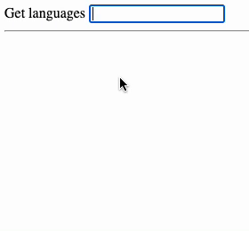
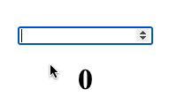

# RxJS

یادگیری RxJS به شما امکان می‌دهد تا با استفاده از reactive programming، جریان‌های داده پیچیده و async را مدیریت کنید. با RxJS می‌توانید عملیات‌هایی مانند فیلتر کردن، نگاشت و ترکیب جریان‌های داده را به سادگی انجام دهید. در این بخش، اصول پایه RxJS، آبجکت‌های Observables و اپراتورها و نحوه استفاده از آن‌ها را خواهید آموخت.

- Observable, Observer
- Subject
- Subscription
- Create (from, of)
- Combine (merge, concat, forkJoin, race)
- Transform (switchMap, mergeMap, concatMap, exhaustMap)
- Filter (takeUntil, distinctUntilChanged, take)
- Error handling (catchError)

## منابع
- [Rxjs Documentation](https://rxjs.dev/guide/overview)
- [Rxjs marbles](https://rxmarbles.com/)

## تمرین ها
1. با تکمیل کردن این [کد](https://stackblitz.com/edit/rxjs-cge6nc?file=index.ts) رفتار سرچ زبانهای برنامه نویسی را پیاده سازی کنید. به این صورت که با تایپ هر حرف با debounce دو ثانیه همه ی زبان های برنامه نویسی که در لیست داده شده هست و شامل کوئری تایپ شده است را نمایش دهد.

2.  با تکمیل کردن این [کد](https://stackblitz.com/edit/rxjs-qxz9vf?file=index.ts) یک شمارنده پیاده سازی کنید که پس از وارد کردن یک عدد در اینپوت و زدن اینتر عدد شمارنده با شمارش به آن عدد میرسد. اگر عدد فعلی از آن کمتر باشد شمارنده افزایشی ست و اگر عدد فعلی از آن بیشتر باشد شمارنده کاهشی ست.

